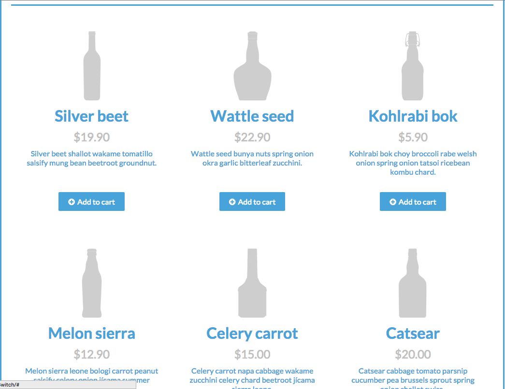
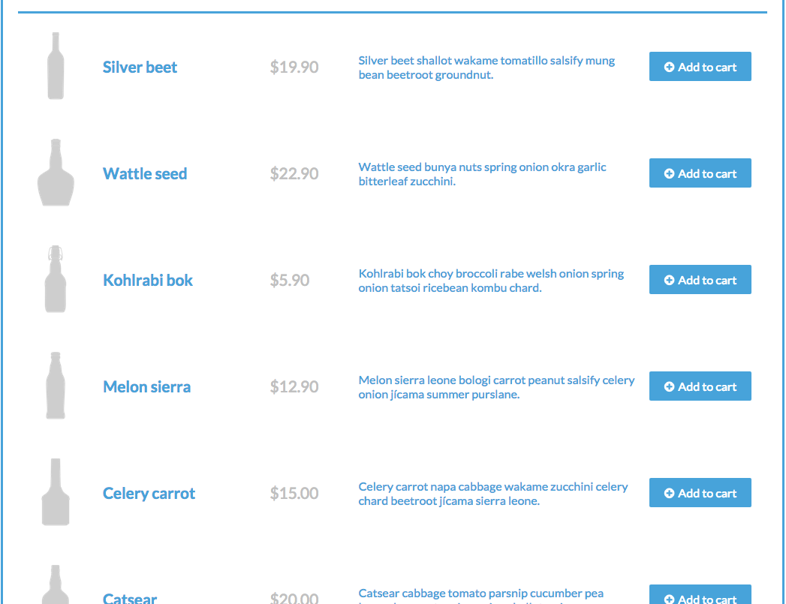

# Beer Layout

## Description

When working with media queries and responsive design, we are not limited to just making our grid change from three columns down to one.

In this exercise you'll be using CSS breakpoints and media queries to have two different displays for the same content for desktop and mobile devices

## Objectives

### Learning Objectives

After completing this assignment, you should…

* Understand HTML/CSS Layout
* Understand @media queries
* Be able to restyle and relayout elements at different screen sizes
* Plan media queries to reduce reuse of code
* Use Broccoli and SASS to organize and manage style code


### Performance Objectives

After completing this assignment, you be able to effectively use

* Use CSS Positioning
* Use `@media` queries with multiple requirements
# Use flexbox to manage content alignment, grids, and layout

## Details

### Deliverables

* A project using basic broccoli build tools including
  - `public` directory with `index.html`
  - `bower.json` file with dependency of Normalize
  - `package.json` file with dependencies
    *	`broccoli`
    *	`broccoli-merge-trees`
    *	`broccoli-sass`
  - `.gitignore` to make sure you don't commit things you don't need
  - `Brocfile.js` - Setting up merge tools and sass compilation

## Normal Mode
Normal Mode description

* Create semantic markup that logical groups the content required for the page
* Show a three wide grid on desktop screens
* Show a list view layout on tablet screens < 1024px
* Show a one wide grid layout on phone screens < 460px

### Phone and Desktop Layout



### Tablet Layout



## Tasks

```
* [ ] Create a new Issue with these tasks!
* [ ] Use the `git` cli to initialize a new project
* [ ] Checkpoint: Created and committed boilerplate [as listed in the Gitbook](https://rtablada.gitbooks.io/lr-fall-2015/content/resources/project-structure.html)
* [ ] Use the `hub` cli to create a repository called `08-beer-layout`
* [ ] Use the `git` cli to create a branch called `develop`
* [ ] In Github, open a PR _from_ `develop` _into_ `master`
* [ ] Setup build tools
  * [ ] Use NPM to install (with `--save-dev` flag) `broccoli`, `broccoli-sas`, and `broccoli-merge-trees`
  * [ ] Use Bower to install `font-awesome` and `normalize-css`
  * [ ] Set up SASS to compile `sass/app.scss` and allow importing from `bower_components/font-awesome/scss` and `bower_components/normalize-css`
  * [ ] Import `font-awesome` in `app.scss` and set the font_path variable
  * [ ] Merge `public` directory with directories from the bower version of `font-awesome`
* [ ] Checkpoint: Create the markup to represent one item from the layout
  * [ ] Markup: Bottle
  * [ ] Markup: Title
  * [ ] Markup: Price
  * [ ] Markup: Description
  * [ ] Markup: Button
  * [ ] Complete: Commit & Push `public/index.html`
* [ ] Checkpoint: Finish the markup
  * [ ] Duplicate item markup to make full grid
  * [ ] Change content for new items
    * [ ] Images
    * [ ] Titles
    * [ ] Description
  * [ ] Complete: Commit & Push `public/index.html`
* [ ] Add styles for page
  * [ ] Checkpoint: Style the Layout of the site on desktop
    * [ ] Layout Grid 3 wide
    * [ ] Style: Bottle
    * [ ] Style: Title
    * [ ] Style: Price
    * [ ] Style: Description
    * [ ] Style: Button
    * [ ] Complete: Commit & Push `sass` directory
  * [ ] Checkpoint: Style the Layout of the site on phone
    * [ ] Layout Grid 1 wide
    * [ ] Adjust sizes as needed to compensate for screen size
    * [ ] Complete: Commit & Push `sass` directory
  * [ ] Checkpoint: Style the Layout of the site on tablet
    * [ ] Layout List items wide
    * [ ] Adjust sizes as needed to compensate for screen sizes
    * [ ] Complete: Commit & Push `sass` directory
```

## Additional Resources

- [Learn CSS Layout](http://learnlayout.com/)
- [Flexbox Guide and Reference](https://css-tricks.com/snippets/css/a-guide-to-flexbox/)
- [Default Project Structure](https://rtablada.gitbooks.io/lr-fall-2015/content/resources/project-structure.html)
- [Broccoli Merge Trees Docs](https://github.com/broccolijs/broccoli-merge-trees)
- [Broccoli SASS Docs](https://github.com/joliss/broccoli-merge-trees)
