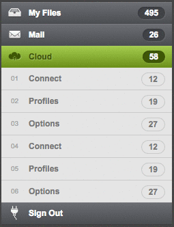
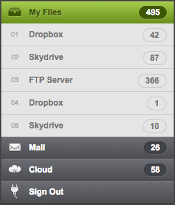
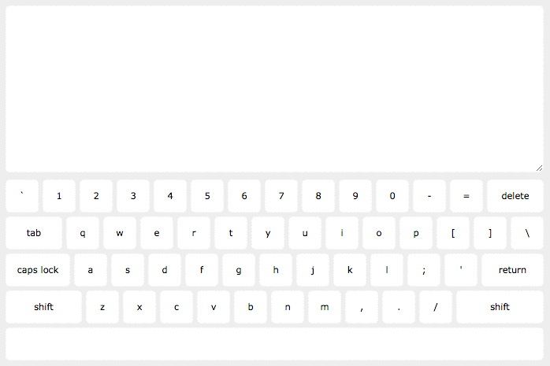
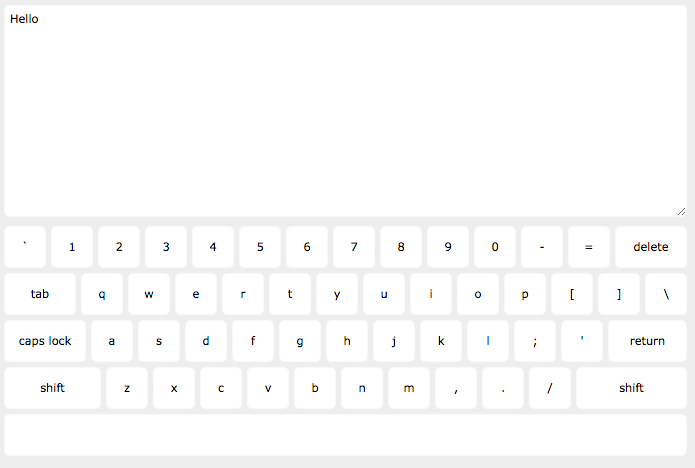
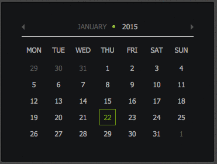
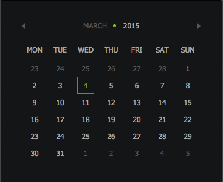

# jQuery Practice

## Description

Practice DOM traversal and manipulation

## Objectives

### Learning Objectives

After completing this assignment, you should...

* Be familiar with the different jQuery DOM traversal and manipulation methods
* Be familiar with jQuery event listeners
* Understand how to modify styles dynamically by adding classes

### Performance Objectives

After completing this assignment, you should be able to...

* Start a new jQuery project using bower
* Create UI with CSS (SASS) and HTML

## Details

### Deliverables

* A repo containing at standard boilerplate with files for each mode:

  * `public/accordian.html` & `public/accordian.js` & `public/accordian.css`
  * `public/keyboard.html` & `public/keyboard.js` & `public/keyboard.css`
  * `public/calendar.html` & `public/calendar.js` & `public/calendar.css`

### Requirements

* Todos/Plan of Attacks for each Mode

## Easy Mode

Recreate the accordion below using CSS, JavaScript, and jQuery.

## Normal Mode

Recreate the keyboard below using CSS, JavaScript, and jQuery.
Without worrying about Shift or CapsLock state.

## Hard Mode

Add Shift and CapsLock to the keyboard

## Bonus Mode

Recreate the calendar below using CSS, JavaScript, and jQuery.

