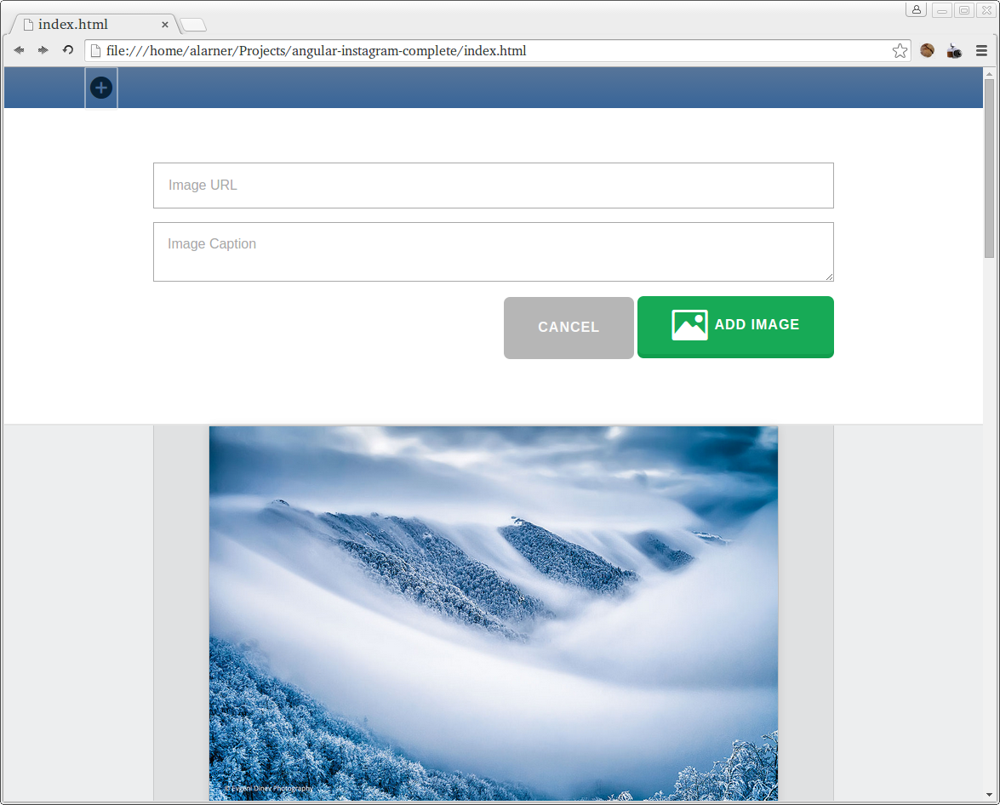

# Image Board

## Description

Create an image board that saves submissions to tiny-lr server.

## Objectives

### Learning Objectives

After completing this assignment, you should…

* Be able to use AJAX, DOM events, and Element Creation using jQuery

### Performance Objectives

After completing this assignment, you be able to effectively use

* jQuery AJAX
* jQuery Selectors
* jQuery Append
* jQuery to Create Elements

## Details

### Deliverables

* A repo containing at least:
  * `public/index.html`
  * `src/app.js`
  * Build Tools including `Brocfile.js`

### Requirements

* No JSHint warnings or errors

## Normal Mode
Using the tools you've learned in class, create a responsive image board that allows you to add images and captions via a url.
The images that are added to the image board should be saved to tiny-lr server, so that when you reload the page, they are not lost.
Below are screenshots of what your app should look like.

In addition, you should have:
- The navbar should have a button that, slides down the edit image form

### Mobile

### Desktop

### Add Image Form

## Hard Mode

- The form to add an image should properly validate the image URL by at minimum
  checking for a http:// or https:// prefix and require a non-empty description.
- Create a username field and allow filtering by `username`

## Notes

This will mimic a lot of the work we did for our contact book today in class.
