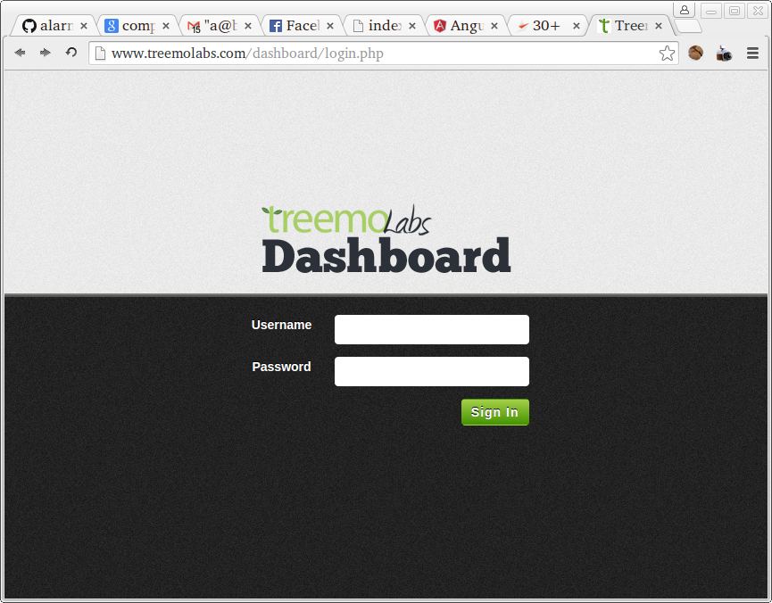

# Login form with Backbone

## Description
Using Backbone Models and Views, build a login form.
The form should check to ensure that the username and password are filled in before checking to see if the username/password combination is in the list below.

## Objectives

### Learning Objectives

After completing this assignment, you should...

* Understand how to pull the "truth out of the DOM"

### Performance Objectives

After completing this assignment, you be able to effectively use

* Backbone Views

## Details

### Deliverables

* A repo containing at least:
  * `public/index.html`
  * `src/**.js`
  * Build Tools

> **NOTE** Use the `yo backbone-broccoli` generator to get started

### Requirements

* No JSHint warnings or errors

## Functionality Mode
* The login form should alert if the login attempt fails (did not match username and password)
* If the user logs in successfully they should be redirected to http://theironyard.com
* The email address field should not allow non-email address input.
* The password address field should have the letters obfuscated.
* The form should submit if the user types enter or clicks the submit button.
* Valid username / password combinations should be:
	* `aaron@theironyard.com` / `password123`
	* `admin@google.com` / `pandas`
	* `<your email address>` / `honeycrisp`

## Styling Mode
Style your login form to look like this:

The Logo used can be [found here](treemoLabs-logo.png).
The background patterns can be found [here](bg-login-top.png) and [here](bg-login.png).

## Insane Mode

Use tiny-lr server and jQuery to check the username and password combination against a list retrieved from the server instead of from a hard coded list in the controller.
Log each login attempt on the tiny-lr server for later lookup.

## Notes

Hints: For email address validation use the HTML5 type="email" attribute.
To get the form to submit properly on enter and clicking submit use the ng-submit directive on wrapping form element.

## Additional Resources

* http://backbonejs.org/
* https://github.com/jashkenas/backbone/wiki/Backbone%2C-The-Primer
