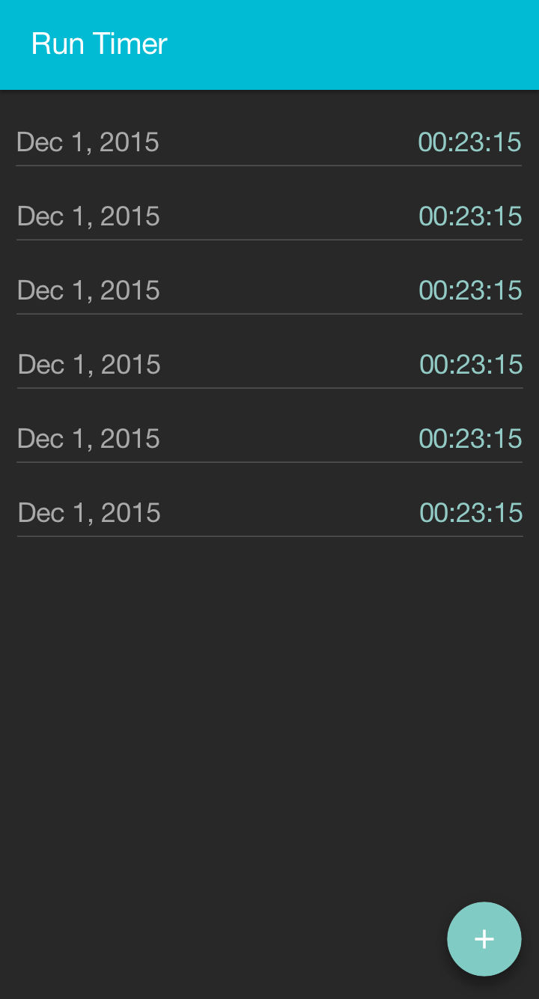
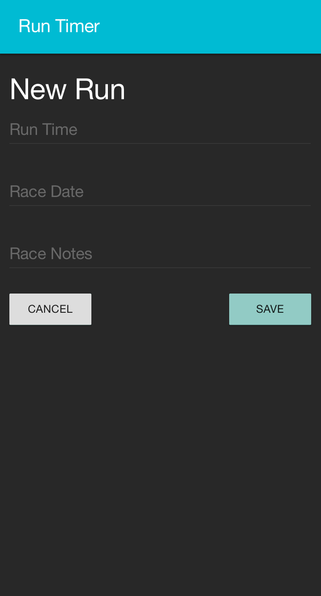
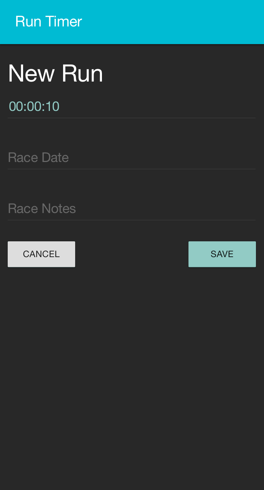
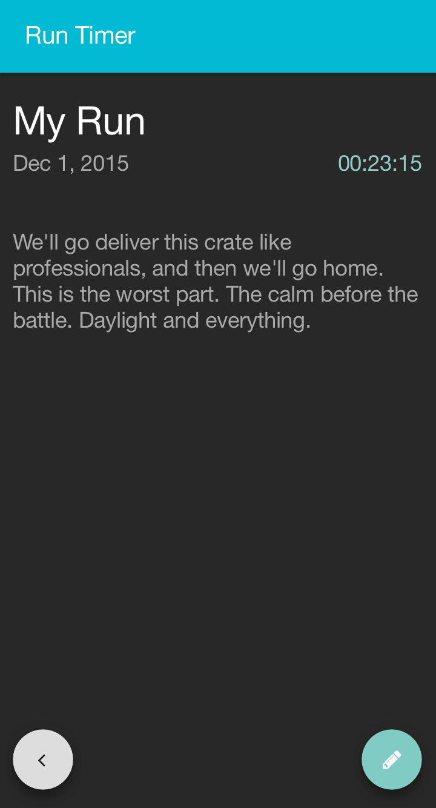

# Run Timer with Backbone

## Description

Using Backbone Models and Views, build the following Run Timer.
Your designer has given you a clickable prototype as well as mockups for the new run timer they want to build.
Using what you know of Backbone, make a styled and functional app based on these assets.

## Objectives

### Learning Objectives

After completing this assignment, you should...

* Understand how to use Bacbone.js to build a CRUD app

### Performance Objectives

After completing this assignment, you be able to effectively use

* Backbone Views
* Backbone Models
* Backbone Collections
* Backbone Router

## Details

### Deliverables

* A repo containing at least:
  * `public/index.html`
  * `src/**.js`
  * `sass/**.scss`
  * Build Tools

> **NOTE** Use the `yo backbone-broccoli` generator to get started

### Requirements

* No JSHint warnings or errors

## Normal Mode

Recreate the following app based on the following screenshots and clickable prototype.

### [Clickable Prototype](https://invis.io/3U50MD2TC)

* https://invis.io/3U50MD2TC

### Index Page

This page lists all existing runs

### New Run

Each run should have a run time (HH:MM:SS), Race Date (you can use a `type="date"` input), Race Notes (allowing notes for how the race went).

> The second screenshot shows input into one of the fields.

### Run Details

This shows the date, time, and notes for a single run.

> **NOTE** These screens do not show an edit view, but your app should have an edit screen similar to the "New Run" screen

## Brand/Design Resources

> You should store these as SASS variables for use around your app styles.

### Colors

* Button Grey - #ddd
* Button Green - #80cbc4
* Header Bar Blue - #00bbd3
* Title White - #fff
* Regular Text - rgba(255, 255, 255, 0.6)
* Placeholder Text - rgba(255, 255, 255, 0.4)
* Green Text - #92cbc5
* Button Text Grey - #1c1c1c

### Typography

* Font Family - Roboto
* Icon Font - Font Awesome
* Base Line Height - 18px

## Additional Resources

* http://backbonejs.org/
* https://github.com/jashkenas/backbone/wiki/Backbone%2C-The-Primer
