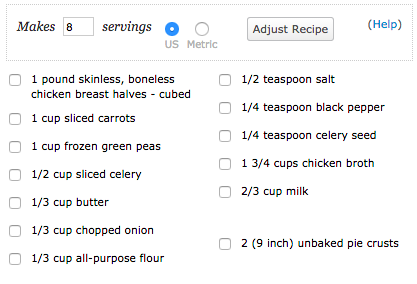
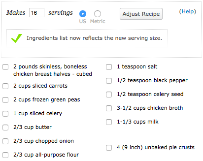

# Recipe Card TDD

## Objectives

After completing this assignment, you should be able to:

* Demonstrate understanding of Ember.js Components
* Demonstrate competence with Ember.js testing

## Details

In this assignment you will turn user stories for an application feature into Test Driven Code.
This means you will start with Acceptance tests, then Integration Tests for components, then unit tests (if you need unit tests).

### Deliverables

* An ember-cli project
* A Travis CI Passing Build

### Requirements

* Tests

## Normal Mode

```
- [ ] Write at least one acceptance test to try to define the behavior of a recipe card route
- [ ] Test drive components down to reduce complexity in your route
```

### User Stories

```
- [ ] A user can see the `recipe-items` for a single `recipe`
- [ ] A user can modify the `servings` for a `recipe` and see updated values for `recipe-items`
```

#### Default Servings



#### Recomputed Serving Sizes




## Hard Mode

```
- [ ] A user can see a list of all recipes
- [ ] A user can navigate to the detail page for a single recipe
```

## Resources

* [Ember Testing Guides](http://guides.emberjs.com/v2.2.0/testing/)
* [Ember CLI Mirage Docs](http://www.ember-cli-mirage.com/docs/v0.2.x/)
